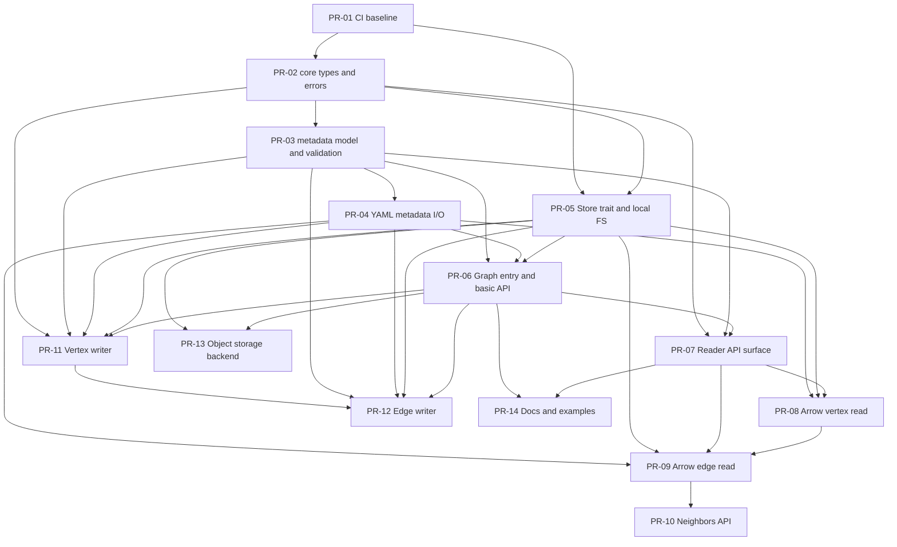

# GraphAr Rust API PR Split

This directory turns the recommendations from the PR split analysis report PDF under `docs/` into a set of PR-ready
Markdown files. Each file corresponds to one PR and includes: goal, scope, implementation steps, tests, acceptance
criteria, and dependencies.

Progress tracking: see `docs/pr-split/STATUS.md`.

Conventions:
- Paths like `src/...` and `tests/...` are relative to the Rust-native crate root. If you use a workspace / multi-crate
  layout, adjust paths during implementation; the PR boundaries remain the same.
- The original report assumes a crate named `graphar`. If the final crate name differs, only the module paths and
  re-exports change; the split is still valid.
- Dependencies use `PR-XX` to mean "must be merged first".

## PR List

- [PR-01: Rust crate scaffold and CI baseline](pr-01-ci-baseline.md)
- [PR-02: Core types and error model](pr-02-core-types-errors.md)
- [PR-03: Metadata model and validation](pr-03-metadata-model-validation.md)
- [PR-04: YAML metadata I/O](pr-04-metadata-yaml-io.md)
- [PR-05: Store abstraction and local filesystem backend](pr-05-store-fs.md)
- [PR-06: Graph entry and basic API](pr-06-graph-entry.md)
- [PR-07: Reader API surface](pr-07-reader-api-surface.md)
- [PR-08: Arrow batch read (vertex)](pr-08-arrow-vertex-read.md)
- [PR-09: Arrow batch read (edge)](pr-09-arrow-edge-read.md)
- [PR-10: Neighbors API](pr-10-neighbors-api.md)
- [PR-11: Writer (vertex)](pr-11-vertex-writer-rowbuilder.md)
- [PR-12: Writer (edge)](pr-12-edge-writer.md)
- [PR-13: Object storage backend](pr-13-object-store-backend.md)
- [PR-14: Docs and examples](pr-14-docs-examples.md)

## Critical Path and Parallelism

- Critical path: PR-01 -> PR-02 -> PR-03 -> PR-04 -> PR-06 -> PR-07 -> PR-08 -> PR-09 -> PR-10
- PR-05 is not on the longest chain, but PR-06 requires it. Run PR-03 and PR-05 in parallel to avoid blocking the Graph
  entry closure.
- Land the read path before writers (PR-11/12) and object storage (PR-13). Finish with docs/examples (PR-14).

## Storage Backend Choice (OpenDAL?)

GraphAr data is commonly stored on local filesystems and object stores. For PR-05/PR-13, pick one of:
- OpenDAL (`opendal`): broad backend coverage across many services. Implement a `Store` backend on top of
  `opendal::Operator` (use the blocking API for sync readers). Keep credentials inside the `Store` instance; no global
  init.
- Arrow `object_store`: tight Arrow/Parquet integration (range reads, Parquet I/O) and fewer glue layers. Implement
  `Store` as a thin adapter around `ObjectStore`.

You can support both behind features (e.g. `opendal`, `object_store`) if the `Store` trait stays minimal.

## Dependencies (DAG)

## Parallel Phases (Reference)

```mermaid
flowchart LR
  subgraph PhaseA[Phase A: foundation]
    PR01a[PR-01]
  end

  subgraph PhaseB[Phase B: core types]
    PR02a[PR-02]
  end

  subgraph PhaseC[Phase C: metadata and store]
    PR03a[PR-03]
    PR05a[PR-05]
  end

  subgraph PhaseD[Phase D: YAML metadata]
    PR04a[PR-04]
  end

  subgraph PhaseE[Phase E: Graph entry closure]
    PR06a[PR-06]
  end

  subgraph PhaseF[Phase F: reader surface and optional tracks]
    PR07a[PR-07]
    PR11a[PR-11]
    PR13a[PR-13]
  end

  subgraph PhaseG[Phase G: Arrow read and docs]
    PR08a[PR-08]
    PR12a[PR-12]
    PR14a[PR-14]
  end

  subgraph PhaseH[Phase H: Arrow edge read]
    PR09a[PR-09]
  end

  subgraph PhaseI[Phase I: Neighbors]
    PR10a[PR-10]
  end

  PhaseA --> PhaseB --> PhaseC --> PhaseD --> PhaseE --> PhaseF --> PhaseG --> PhaseH --> PhaseI
```

